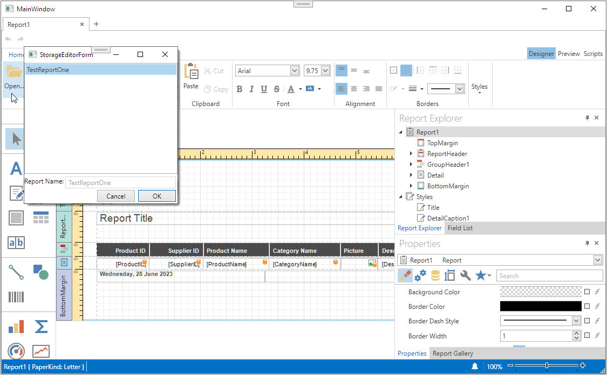

<!-- default badges list -->

<!-- default badges end -->

# Reporting for WPF - How to Implement a Report Storage

This example implements a report storage to persist report definitions in a database or in any other custom location. A report storage enables end-users to create and customize reports in the Report Designer and have a common target for saving and sharing all reports.

## Files to Review

* [MainWindow.xaml](./CS/WpfApplication38/MainWindow.xaml) (VB: [MainWindow.xaml](./VB/WpfApplication38/MainWindow.xaml))
* [MainWindow.xaml.cs](./CS/WpfApplication38/MainWindow.xaml.cs) (VB: [MainWindow.xaml.vb](./VB/WpfApplication38/MainWindow.xaml.vb))
* [DataSetFileStorage.cs](./CS/WpfApplication38/Storages/DataSetFileStorage.cs) (VB: [DataSetFileStorage.vb](./VB/WpfApplication38/Storages/DataSetFileStorage.vb))
* [StorageDataSet.cs](./CS/WpfApplication38/Storages/StorageDataSet.cs) (VB: [StorageDataSet.vb](./VB/WpfApplication38/Storages/StorageDataSet.vb))
* [StorageEditorForm.xaml](./CS/WpfApplication38/Storages/StorageEditorForm.xaml) (VB: [StorageEditorForm.xaml](./VB/WpfApplication38/Storages/StorageEditorForm.xaml))
* [StorageEditorForm.xaml.cs](./CS/WpfApplication38/Storages/StorageEditorForm.xaml.cs) (VB: [StorageEditorForm.xaml.vb](./VB/WpfApplication38/Storages/StorageEditorForm.xaml.vb))
* [XtraReport1.cs](./CS/WpfApplication38/Storages/XtraReport1.cs) (VB: [XtraReport1.vb](./VB/WpfApplication38/Storages/XtraReport1.vb))

## Documentation

- [Custom Report Storage](https://docs.devexpress.com/XtraReports/10001/detailed-guide-to-devexpress-reporting/store-and-distribute-reports/store-report-layouts-and-documents/custom-report-storage)

## More Examples

- [Reporting for Web Forms - Report Designer with Report Storage and Custom Command](https://github.com/DevExpress-Examples/reporting-web-forms-designer-storage)
- [Reporting for WinForms - How to Implement a Custom Report Storage](https://github.com/DevExpress-Examples/reporting-winforms-custom-report-storage/)
<!-- feedback -->
## Does this example address your development requirements/objectives?

 

(you will be redirected to DevExpress.com to submit your response)
<!-- feedback end -->
